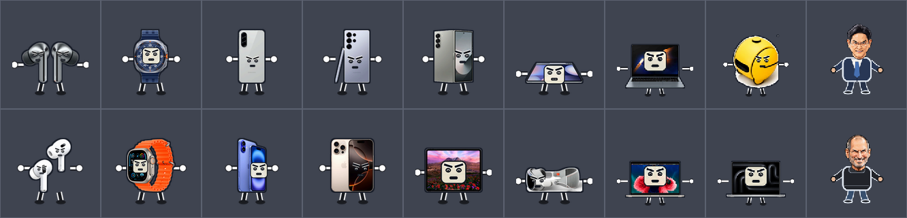

# TECH WAR · Track D 아트와 사운드

이 브랜치는 테크니컬 아티스트 담당 결과물을 공유합니다. 게임 클라이언트·밸런스 작업 브랜치와의 통합은 팀에서 진행합니다.



- 캐릭터: 세미콘·오차드 각 9종, 총 18종과 애니메이션 444프레임. 일반 유닛은 제품 형태와 전투 표정을, T9 보스는 이재용·스티브 잡스 캐리커처를 사용합니다.
- 이미지 배포 파일: [`assets/manifest.json`](assets/manifest.json), [`assets/atlases`](assets/atlases), [`assets/frames`](assets/frames)
- 사운드: 효과음 67개, 진영별 전투 BGM 4개씩 총 8개. [`assets/audio/manifest.json`](assets/audio/manifest.json)에서 경로를 확인할 수 있습니다.
- 제작·연동 설명: [`assets/production-handoff.md`](assets/production-handoff.md), [`technical-artist-implementation-plan.md`](technical-artist-implementation-plan.md)

## 미리보기

저장소를 내려받은 뒤 루트에서 로컬 서버를 실행하고 아래 주소를 엽니다. 이미지·오디오 경로가 같은 출처에서 로딩됩니다.

```bash
python3 -m http.server 8000
```

- 캐릭터 애니메이션: `http://localhost:8000/assets/previews/index.html`
- 18종 사진과 애니메이션 비교: `http://localhost:8000/assets/previews/photo-animation-gallery.html`
- 전체 이미지 갤러리: `http://localhost:8000/assets/image-gallery.html`
- 사운드 미리듣기: `http://localhost:8000/assets/audio/index.html`

## 파일 검사

```bash
python3 assets/tools/validate_assets.py
```

현재 검사 결과는 캐릭터 18종·원본/아틀라스 프레임 각 444개·아틀라스 4장·효과음 67개·BGM 8개입니다. 제품·인물 참조 사진의 출처와 배포 전 이용 조건은 [`assets/source/product-photos/sources.json`](assets/source/product-photos/sources.json) 및 [`assets/source/boss-portraits/README.md`](assets/source/boss-portraits/README.md)에 기록했습니다.
